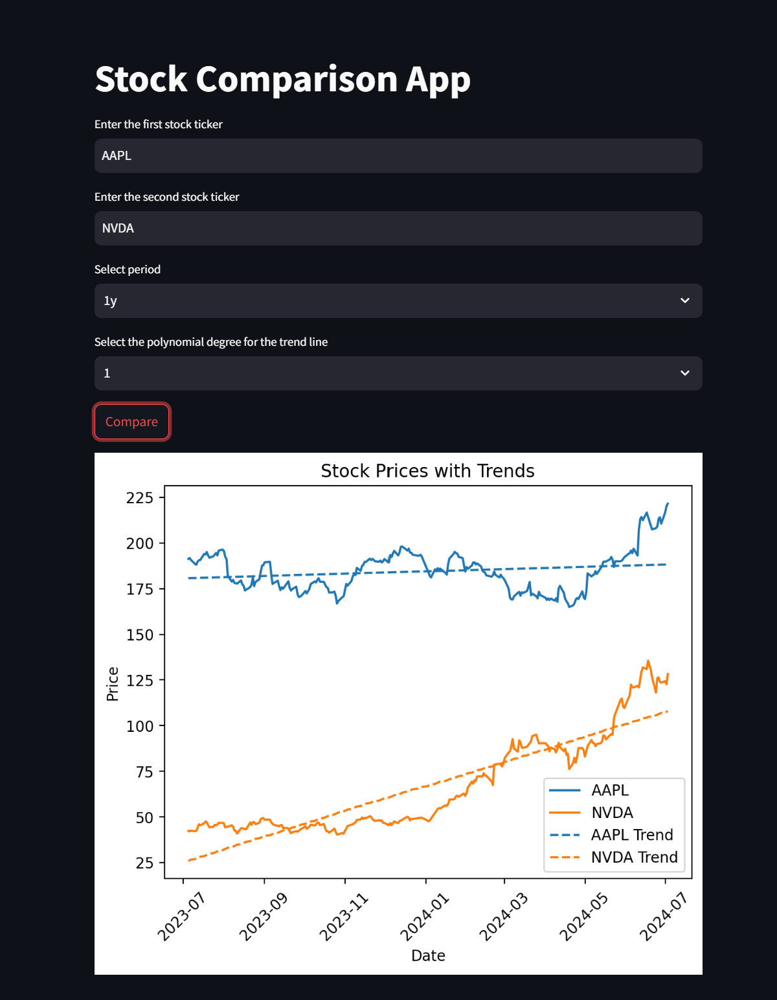

# GitHub Copilot Intro Slides

Este projeto contém os slides para o workshop intitulado **"GitHub Copilot: Conheça, Aprenda e Use em um Projeto Real do Zero em 15 Minutos"**. Os slides foram projetados para introduzir os participantes ao GitHub Copilot, cobrindo suas funcionalidades, benefícios e aplicações práticas em projetos do mundo real.

## Sobre o Workshop

Este workshop tem como objetivo fornecer uma introdução ao GitHub Copilot, um programador parceiro de IA que ajuda os desenvolvedores sugerindo trechos de código, autocomplete e outros. Os participantes aprenderão como integrar e usar o GitHub Copilot em seu fluxo de desenvolvimento, aprimorando a produtividade e a qualidade do código.

## Pré-requisitos

- IDE com suporte ao GitHub Copilot instalado

## Como Executar os Slides

Embora os slides estejam em markdown, eles foram criados para serem usados com o reveal.js, uma estrutura para criar facilmente apresentações usando HTML. Para executar os slides localmente, siga estes passos:

1. Clone o repositório para sua máquina local.
2. Navegue até o diretório do projeto.
3. Execute o script `run.sh` para iniciar um servidor local e abrir os slides no seu navegador web padrão.

```bash
./run.sh
```

**Nota**: Os slides estarão acessíveis em `http://localhost:8000`.

**Nota**: *É possível ver os slides em [slides.md](slides.md), porém, a engine do GitHub não suporta vídeos, perdendo os exemplos.*

## Mãos na massa

O prompt básico para o mão na massa está em [prompt.txt](prompt.txt).
Os prompts complementares estão em [prompts_extra.txt](prompts_extra.txt).

O código está em `./stocks_app` e o README.md está em [`./stocks_app/README.md`](stocks_app/README.md).

